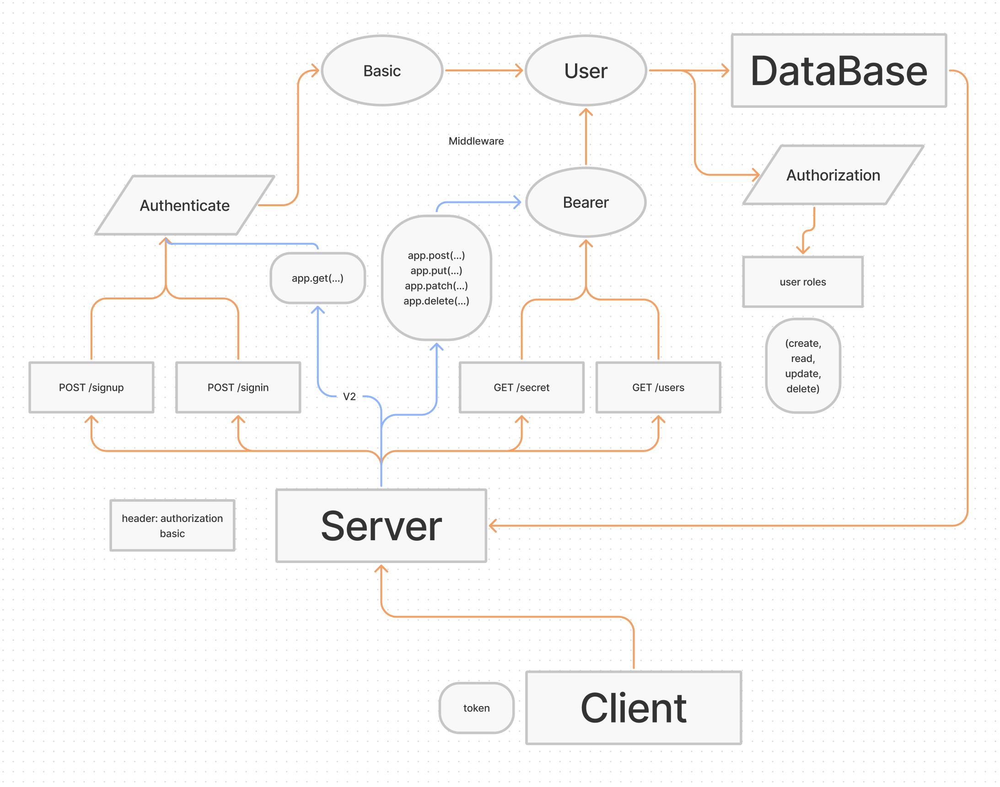

# Bearer Authorization

Created by Ryan Emmans

## Summary of Problem Domain

### **Phase 1 Requirements**

#### **As a user, I want to create a new account so that I may later login**

- Using a tool such as httpie, postman, or a web form:
  - Make a POST request to the/signup route with username and password
  - Your server should support both JSON and FORM data as input
  - On a successful account creation, return a 201 status with the user object in the body
  - On any error, trigger your error handler with an appropriate error

#### **As a user, I want to login to my account so that I may access protected information**

- Using a tool such as httpie, postman, or a web form:
  - Make a POST request to the /signin route
  - Send a basic authentication header with a properly encoded username and password combination
  - On a successful account login, return a 200 status with the user object in the body
  - On any error, trigger your error handler with the message “Invalid Login”

### **Phase 2 Requirements**

Any user that has successfully logged in using basic authentication (username and password) is able to continuously authenticate … using a “token”.

### **Phase 3 Requirements**

In this final phase, the new requirement is to extend the restrictive capabilities of our routes to our API, implementing a fully functional, authenticated and authorized API Server using the latest coding techniques

Specifically, we want to make the following restrictions:

- Regular users can **READ**
- Writers can **READ** and **CREATE**
- Editors can **READ**, **CREATE**, and **UPDATE**
- Administrators can **READ**, **CREATE**, **UPDATE**, and **DELETE**

Routes that end up performing those actions in our API/Database need to be protected by both a valid user and that user’s permissions

## Links to application deployment

- [Heroku Main Branch](https://ryanemmans-auth-api.herokuapp.com/)
- [GitHub Actions](https://github.com/ryanemmans/auth-api/actions)
- [Pull Requests](https://github.com/ryanemmans/auth-api/pulls?q=is%3Apr+is%3Aclosed)

## UML

## Routes

Your server should respond to the following routes:

- POST `/signup` to create a user
- POST `/signin` to login a user and receive a token
- GET `/secret` should require a valid bearer token
- GET `/users` should require a valid token and “delete” permissions

V2 API Routes (`/api/v2/...`) must now be protected with the proper permissions based on user capability, using Bearer Authentication and an ACL

- `app.get(...)` should require authentication only, no specific roles
- `app.post(...)` should require both a bearer token and the create capability
- `app.put(...)` should require both a bearer token and the update capability
- `app.patch(...)` should require both a bearer token and the update capability
- `app.delete(...)` should require both a bearer token and the delete capability
